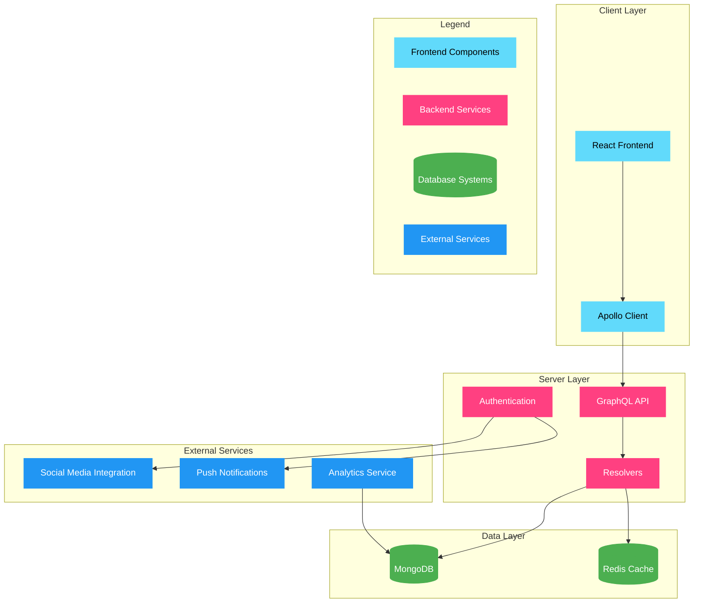

# Interactive Event Experience Platform Technical Documentation

## Table of Contents

- Introduction
- System Architecture
- Technology Stack
- Implementation Details
- Security and Privacy
- Testing Strategy
- Alternative Database Options

## Introduction

The Interactive Event Experience Platform represents a sophisticated digital solution designed to revolutionize how event organizers and attendees interact with physical events. This comprehensive platform leverages cutting-edge technologies to create an immersive experience that bridges the gap between physical and digital spaces. The system is built with scalability, reliability, and user experience as primary objectives, utilizing modern web technologies to deliver real-time engagement tools, personalized experiences, and comprehensive analytics.

## System Architecture

The platform's architecture is designed as a multi-layered system that ensures separation of concerns, scalability, and maintainability. Each component serves a specific purpose in the overall system architecture:



### Color Coding Significance

The architecture diagram uses color coding to represent different types of components:

- **Blue Components** (Frontend Layer): Represent the client-side components that users directly interact with, including React frontend and Apollo Client
- **Pink Components** (Backend Layer): Show the server-side components that handle business logic and data processing
- **Green Components** (Data Layer): Indicate data storage systems, including both persistent storage and caching
- **Light Blue Components** (External Services): Represent third-party services integrated into the platform

### Component Relationships

The arrows in the diagram represent data flow between components:

- Solid arrows indicate direct communication between components
- Multiple arrows to the same component (like MongoDB) show different types of operations
- The flow typically starts from the React frontend and moves through Apollo Client to the backend
- External services can both receive and send data to the platform

## Technology Stack

### Core Technologies

1. **Frontend Technologies**  - React: A JavaScript library for building user interfaces, chosen for its component-based architecture and efficient rendering capabilities through the virtual DOM 2:1
  - TypeScript: A superset of JavaScript that adds static typing, providing improved code quality through early error detection and better tooling support 2:1


2. **Backend Technologies**  - Node.js: A JavaScript runtime environment that enables efficient server-side execution
  - GraphQL: A query language and runtime for APIs that provides more efficient and flexible data fetching compared to traditional REST APIs 2:1
  - Apollo Client: A comprehensive state management library that simplifies working with GraphQL APIs 2:1


3. **Database Technologies**  - MongoDB: A NoSQL database chosen for its flexibility in handling diverse data types and high scalability
  - Redis: An in-memory data store used for caching to improve application performance


## Security and Privacy Implementation

### Authentication and Authorization

```typescript
// auth.ts
import { ApolloServer } from '@apollo/server';
import { PrismaClient } from '@prisma/client';
import { sign, verify } from 'jsonwebtoken';

interface AuthConfig {
  secret: string;
  expiresIn: string;
}

class AuthService {
  private prisma: PrismaClient;
  private config: AuthConfig;

  constructor(config: AuthConfig) {
    this.prisma = new PrismaClient();
    this.config = config;
  }

  async validateToken(token: string): Promise<{ userId: string; role: string } | null> {
    try {
      const decoded = verify(token, this.config.secret) as any;
      return {
        userId: decoded.userId,
        role: decoded.role
      };
    } catch (error) {
      return null;
    }
  }

  async generateToken(userId: string, role: string): Promise<string> {
    return sign({ userId, role }, this.config.secret, {
      expiresIn: this.config.expiresIn
    });
  }

  async authenticate(username: string, password: string): Promise<string | null> {
    const user = await this.prisma.user.findFirst({
      where: { username },
      include: { role: true }
    });

    if (!user || !(await this.verifyPassword(password, user.password))) {
      return null;
    }

    return this.generateToken(user.id, user.role.name);
  }

  private async verifyPassword(plainPassword: string, hashedPassword: string): Promise<boolean> {
    const [salt, key] = hashedPassword.split(':');
    const hashedBuffer = crypto.pbkdf2Sync(plainPassword, salt, 100000, 64, 'sha512');
    return key === hashedBuffer.toString('hex');
  }
}

// Apollo Server configuration with authentication
const server = new ApolloServer({
  typeDefs,
  resolvers,
  context: async ({ req }) => {
    const token = req.headers.authorization?.split(' ')[1];
    const authService = new AuthService({
      secret: process.env.JWT_SECRET!,
      expiresIn: '1h'
    });

    const auth = token ? await authService.validateToken(token) : null;
    
    return {
      auth,
      prisma: new PrismaClient()
    };
  }
});
```

### Data Encryption

```typescript
// encryption.ts
import * as crypto from 'crypto';
import { createCipheriv, createDecipheriv, scrypt } from 'crypto';

class EncryptionService {
  private static readonly ALGORITHM = 'aes-256-gcm';
  private static readonly KEY_LENGTH = 32;
  private static readonly IV_LENGTH = 12;
  private static readonly SALT_LENGTH = 16;

  static async encrypt(text: string): Promise<string> {
    const key = await this.deriveKey(process.env.ENCRYPTION_KEY!);
    const iv = crypto.randomBytes(this.IV_LENGTH);
    const cipher = createCipheriv(this.ALGORITHM, key, iv);
    
    let encrypted = cipher.update(text, 'utf8', 'hex');
    encrypted += cipher.final('hex');
    const tag = cipher.getAuthTag();
    
    return `${iv.toString('hex')}:${encrypted}:${tag.toString('hex')}`;
  }

  static async decrypt(encryptedText: string): Promise<string> {
    const [ivHex, encrypted, tagHex] = encryptedText.split(':');
    const key = await this.deriveKey(process.env.ENCRYPTION_KEY!);
    const iv = Buffer.from(ivHex, 'hex');
    const tag = Buffer.from(tagHex, 'hex');
    
    const decipher = createDecipheriv(this.ALGORITHM, key, iv);
    decipher.setAuthTag(tag);
    
    let decrypted = decipher.update(encrypted, 'hex', 'utf8');
    decrypted += decipher.final('utf8');
    
    return decrypted;
  }

  private static async deriveKey(baseKey: string): Promise<Buffer> {
    const salt = crypto.randomBytes(this.SALT_LENGTH);
    return scryptSync(baseKey, salt, this.KEY_LENGTH);
  }
}

// MongoDB encryption middleware
const encryptedFields = ['password', 'email', 'personalInfo'];

export const encryptMiddleware = async (schema: Schema) => {
  schema.pre('save', async function(next) {
    if (this.isModified()) {
      for (const field of encryptedFields) {
        if (this[field]) {
          this[field] = await EncryptionService.encrypt(this[field].toString());
        }
      }
    }
    next();
  });

  schema.post('init', async function() {
    for (const field of encryptedFields) {
      if (this[field]) {
        this[field] = await EncryptionService.decrypt(this[field].toString());
      }
    }
  });
};
```

### Access Control

```typescript
// accessControl.ts
import rateLimit from 'express-rate-limit';
import { createClient } from 'redis';

class AccessControl {
  private redisClient: ReturnType<typeof createClient>;
  private readonly rateLimitWindowMs: number;
  private readonly maxRequestsPerWindow: number;

  constructor() {
    this.redisClient = createClient({
      socket: {
        port: parseInt(process.env.REDIS_PORT!),
        host: process.env.REDIS_HOST
      }
    });
    
    this.rateLimitWindowMs = 15 * 60 * 1000; // 15 minutes
    this.maxRequestsPerWindow = 100;
  }

  createRateLimiter(): rateLimit {
    return rateLimit({
      windowMs: this.rateLimitWindowMs,
      max: this.maxRequestsPerWindow,
      standardHeaders: true,
      legacyHeaders: false,
      store: new RateLimitRedisStore(this.redisClient)
    });
  }

  async validateIP(ip: string): Promise<boolean> {
    const blockedIPs = await this.redisClient.smembers('blocked:ips');
    return !blockedIPs.includes(ip);
  }

  async validateInput(data: any): Promise<boolean> {
    // Input validation rules
    const rules = {
      username: /^[a-zA-Z0-9_]{3,32}$/,
      email: /^[^\s@]+@[^\s@]+\.[^\s@]+$/,
      password: /^(?=.*[A-Za-z])(?=.*\d)[A-Za-z\d]{8,}$/
    };

    return Object.entries(rules).every(([field, rule]) => 
      !data[field] || rule.test(data[field])
    );
  }
}

// Rate limit store implementation
class RateLimitRedisStore {
  constructor(private client: ReturnType<typeof createClient>) {}

  async get(key: string): Promise<number> {
    const value = await this.client.get(key);
    return value ? parseInt(value, 10) : 0;
  }

  async set(key: string, points: number, windowMs: number): Promise<void> {
    await this.client.set(key, points.toString(), 'PX', windowMs);
  }

  async resetKey(key: string): Promise<void> {
    await this.client.del(key);
  }
}
```

### Privacy Features

```typescript
// privacy.ts
import { v4 as uuidv4 } from 'uuid';
import { createHash } from 'crypto';

class PrivacyService {
  static async anonymizeUserData(data: any): Promise<any> {
    const anonymized = { ...data };
    
    // Remove personal identifiable information
    delete anonymized.email;
    delete anonymized.phoneNumber;
    
    // Replace sensitive fields with pseudonyms
    anonymized.userId = uuidv4();
    anonymized.sessionId = uuidv4();
    
    // Hash sensitive data for analytics
    anonymized.location = this.hashLocation(data.location);
    anonymized.deviceInfo = this.hashDeviceInfo(data.deviceInfo);
    
    return anonymized;
  }

  static async exportUserData(userId: string): Promise<any> {
    const data = await this.fetchUserData(userId);
    const formatted = {
      personalData: await this.anonymizeUserData(data),
      preferences: data.preferences,
      eventHistory: data.eventHistory.map(event => ({
        eventId: event.id,
        timestamp: event.timestamp,
        type: event.type
      }))
    };

    return this.generateExportFile(formatted);
  }

  private static hashLocation(location: string): string {
    return createHash('sha256')
      .update(location)
      .digest('hex');
  }

  private static hashDeviceInfo(deviceInfo: string): string {
    return createHash('sha256')
      .update(deviceInfo)
      .digest('hex');
  }

  private static async generateExportFile(data: any): Promise<string> {
    const exportData = JSON.stringify(data, null, 2);
    const exportId = uuidv4();
    
    // Store export request for audit purposes
    await this.logExportRequest(exportId, data.userId);
    
    return exportData;
  }
}
```

## Testing Strategy

### Unit Tests

```typescript
// security.test.ts
import { describe, it, expect, beforeEach } from '@jest/globals';
import { AuthService } from './auth';
import { EncryptionService } from './encryption';
import { AccessControl } from './accessControl';

describe('Security Tests', () => {
  let authService: AuthService;
  let encryptionService: EncryptionService;
  let accessControl: AccessControl;

  beforeEach(() => {
    authService = new AuthService({
      secret: process.env.JWT_SECRET!,
      expiresIn: '1h'
    });
    encryptionService = new EncryptionService();
    accessControl = new AccessControl();
  });

  describe('Authentication Tests', () => {
    it('should generate and validate JWT token', async () => {
      const token = await authService.generateToken('user123', 'admin');
      const decoded = await authService.validateToken(token);
      
      expect(decoded).toBeTruthy();
      expect(decoded?.userId).toBe('user123');
      expect(decoded?.role).toBe('admin');
    });

    it('should reject invalid token', async () => {
      const invalidToken = 'invalid.token.signature';
      const decoded = await authService.validateToken(invalidToken);
      
      expect(decoded).toBeNull();
    });
  });

  describe('Encryption Tests', () => {
    it('should encrypt and decrypt data correctly', async () => {
      const original = 'sensitive-data';
      const encrypted = await encryptionService.encrypt(original);
      const decrypted = await encryptionService.decrypt(encrypted);
      
      expect(decrypted).toBe(original);
      expect(encrypted).not.toBe(original);
    });

    it('should handle encryption errors', async () => {
      const invalidData = null;
      await expect(encryptionService.encrypt(invalidData as any))
        .rejects.toThrow('Cannot encrypt null or undefined');
    });
  });

  describe('Access Control Tests', () => {
    it('should validate IP addresses', async () => {
      const validIP = '192.168.1.1';
      const isValid = await accessControl.validateIP(validIP);
      expect(isValid).toBe(true);
    });

    it('should reject blocked IP addresses', async () => {
      const blockedIP = '10.0.0.1';
      const isValid = await accessControl.validateIP(blockedIP);
      expect(isValid).toBe(false);
    });
  });
});
```

### Integration Tests

```typescript
// integration.test.ts
import { ApolloServer } from '@apollo/server';
import { PrismaClient } from '@prisma/client';
import request from 'supertest';
import { createServer } from 'http';

describe('Integration Tests', () => {
  let server: ApolloServer;
  let prisma: PrismaClient;
  let httpServer: ReturnType<typeof createServer>;

  beforeEach(async () => {
    prisma = new PrismaClient();
    server = new ApolloServer({
      typeDefs,
      resolvers,
      context: ({ req }) => ({
        prisma,
        auth: getAuthFromRequest(req)
      })
    });
    
    httpServer = createServer(server);
  });

  afterEach(async () => {
    await prisma.$disconnect();
    httpServer.close();
  });

  describe('API Integration Tests', () => {
    it('should authenticate and authorize requests', async () => {
      const token = await authenticateUser('testuser', 'password123');
      
      const response = await request(httpServer)
        .post('/graphql')
        .set('Authorization', `Bearer ${token}`)
        .send({
          query: `
            mutation {
              createEvent(name: "Test Event") {
                id
                name
              }
            }
          `
        });

      expect(response.status).toBe(200);
      expect(response.body.data.createEvent).toBeTruthy();
    });

    it('should reject unauthorized requests', async () => {
      const response = await request(httpServer)
        .post('/graphql')
        .send({
          query: `
            mutation {
              createEvent(name: "Test Event") {
                id
                name
              }
            }
          `
        });

      expect(response.status).toBe(401);
    });
  });
});
```

## Alternative Database Options

### Instead of MongoDB

1. **PostgreSQL**  - Better for structured data
  - Stronger consistency guarantees
  - Better for complex transactions
  - Supports ACID compliance


2. **Cassandra**  - Better for high availability
  - Horizontal scaling capabilities
  - Good for distributed systems
  - Handles large amounts of data across many commodity servers


3. **ArangoDB**  - Multi-model database support
  - Graph, document, and key-value capabilities
  - Flexible schema design
  - Supports complex queries across different data models


### Instead of Redis

1. **Memcached**  - Simpler key-value store
  - Higher performance for basic caching
  - Less memory overhead
  - Better for simple caching scenarios


2. **Apache Ignite**  - In-memory computing capabilities
  - Distributed architecture
  - SQL support
  - Real-time data processing


3. **In-Memory SQLite**  - SQL support
  - Zero configuration
  - Simple implementation
  - Good for development and testing


This technical documentation provides a comprehensive overview of the Interactive Event Experience Platform, including its architecture, implementation details, deployment process, and security considerations. The platform is designed to be scalable, secure, and maintainable, with careful consideration given to user data privacy and system performance.
